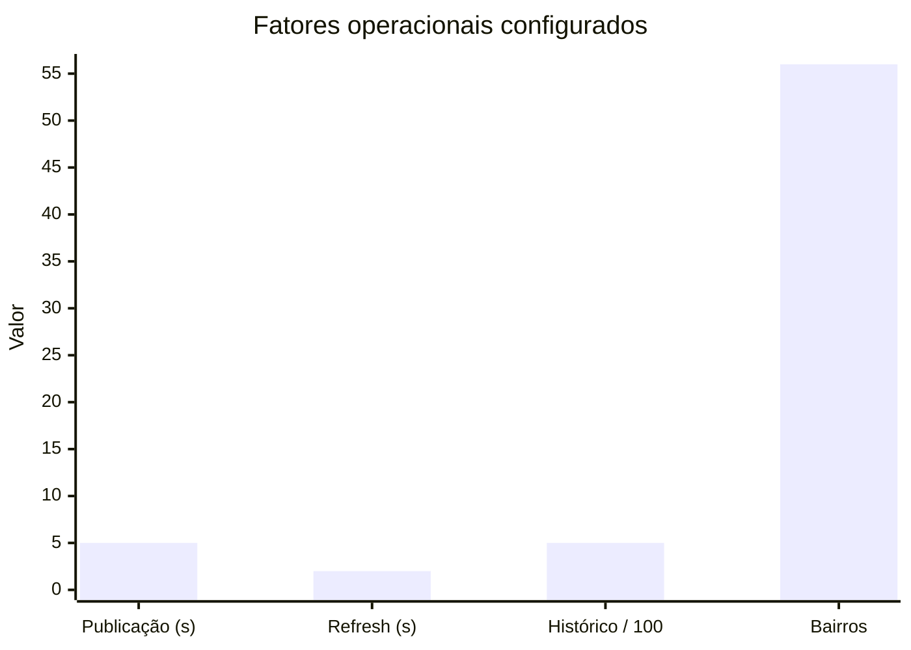
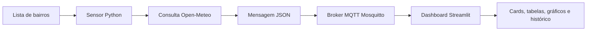
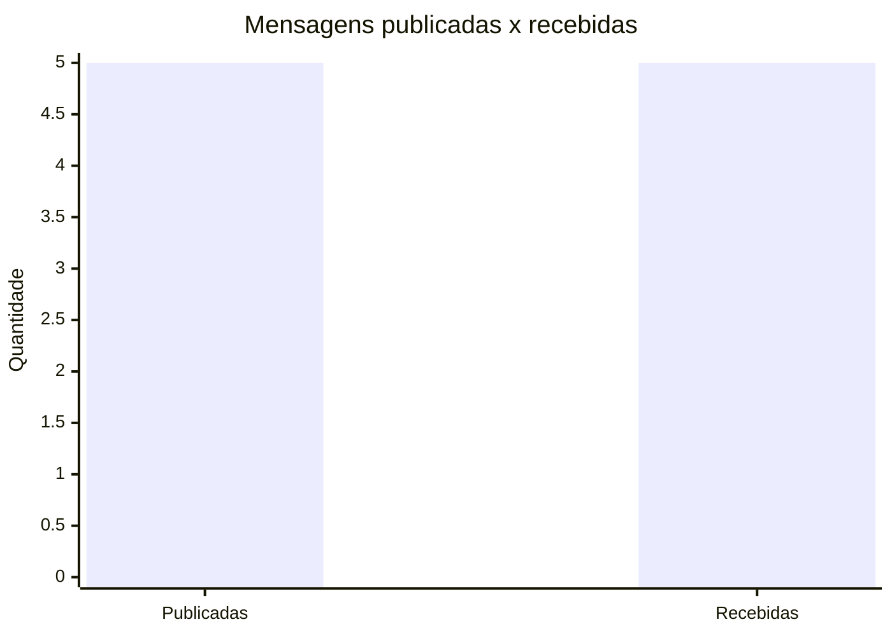
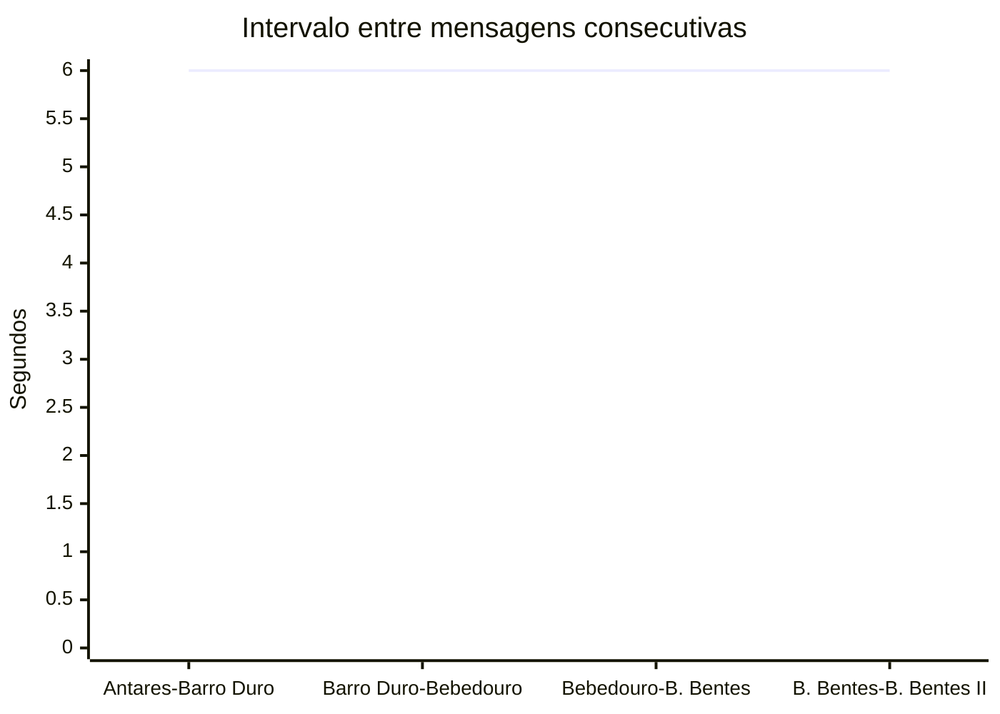
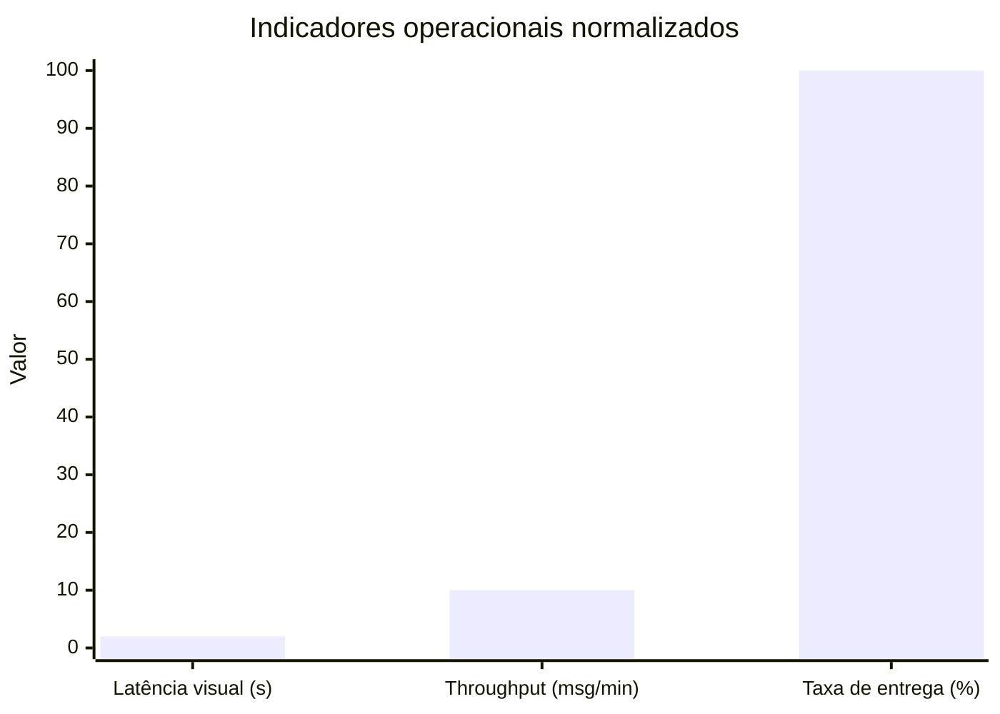
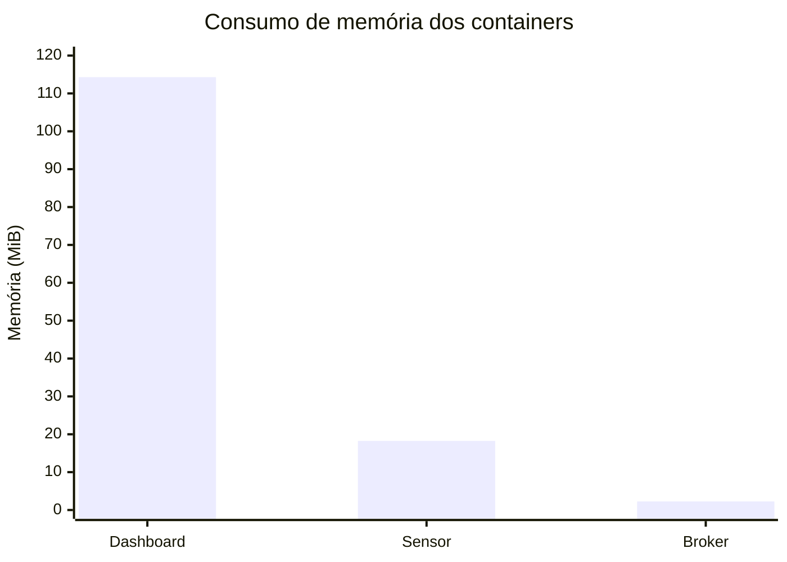
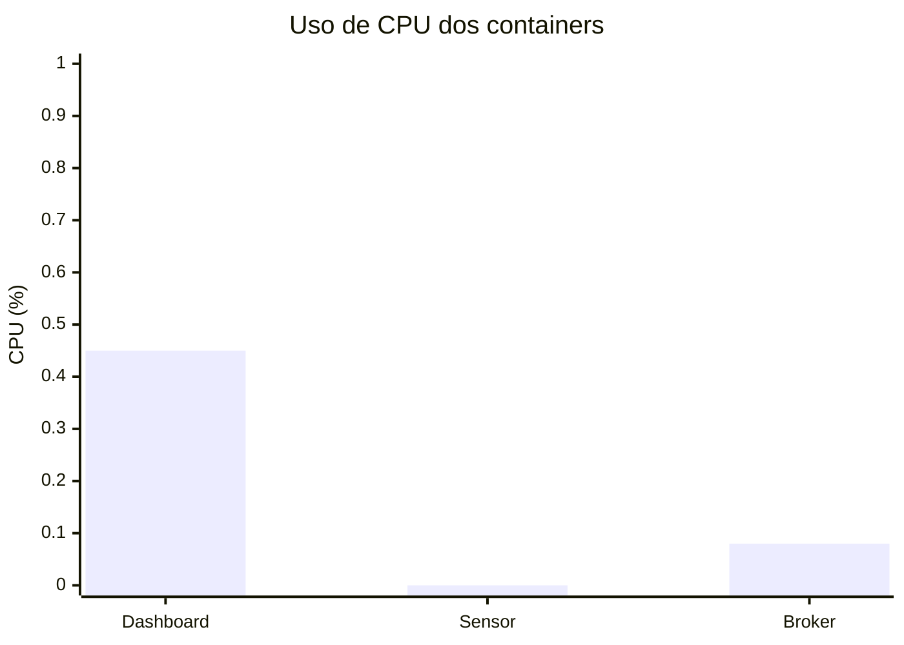
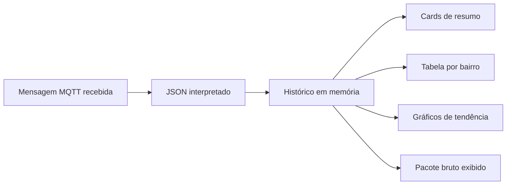

# 5. Avaliação de Desempenho

Esta seção apresenta a avaliação de desempenho do sistema de monitoramento climático em tempo real para bairros de Maceió/AL. A avaliação foi organizada conforme a metodologia proposta por Raj Jain, partindo da definição do objetivo da avaliação, da descrição do ambiente experimental, da seleção das métricas e parâmetros de carga de trabalho e, por fim, da discussão dos resultados obtidos nos experimentos.

## 5.1 Objetivo da avaliação

O objetivo principal da avaliação foi verificar se a solução proposta é capaz de coletar, transmitir, receber e exibir leituras climáticas de forma contínua por meio de uma arquitetura baseada em sensores simulados, protocolo MQTT, broker Mosquitto e dashboard web desenvolvido com Streamlit. Especificamente, buscou-se avaliar: (i) a inicialização correta dos serviços; (ii) a entrega das mensagens MQTT entre o sensor e o dashboard; (iii) o comportamento temporal do fluxo de publicação; (iv) o consumo de recursos computacionais dos containers; (v) a capacidade do dashboard de apresentar os dados recebidos em formato compreensível para o usuário final; (vi) a consulta da última leitura disponível para cada bairro monitorado; e (vii) a exibição de previsão acumulada de chuva para as próximas 1h, 3h e 6h.

## 5.2 Ambiente experimental

Os testes foram executados em um computador MacBook Air com chip Apple M4, 10 núcleos de CPU e 16 GB de memória RAM, executando macOS em arquitetura ARM64. A aplicação foi implantada com Docker 28.5.2 e Docker Compose v2.40.3. A solução é composta por três serviços orquestrados pelo arquivo `docker-compose.yml`: o broker MQTT Mosquitto, o sensor publicador e o dashboard web.

O serviço `mosquitto` utiliza a imagem `eclipse-mosquitto:latest` e disponibiliza o protocolo MQTT na porta 1883 e WebSocket na porta 9001. O serviço `sensor` executa o arquivo `sensor.py`, carrega dinamicamente os bairros de Maceió por meio da API OpenStreetMap/Overpass, mantém cache local da lista de bairros, percorre esses bairros em sequência, consulta dados meteorológicos recentes da API Open-Meteo e publica as leituras no tópico MQTT `iot/chuva`. O serviço `dashboard` executa o arquivo `dashboard_web.py`, assina o mesmo tópico MQTT, armazena as mensagens recebidas em memória e apresenta métricas, gráficos, histórico, previsão de chuva e uma tabela de última leitura por bairro por meio de uma interface web acessível pela porta 8501.

Na configuração utilizada, o sensor foi parametrizado para consultar e publicar uma leitura a cada 5 segundos (`PUBLISH_INTERVAL_SECONDS=5`), avançando para o próximo bairro após cada publicação. Como foram carregados 56 bairros, uma volta completa por todos os bairros leva aproximadamente 5 minutos, desconsiderando pequenas variações causadas pelo tempo de resposta das APIs externas. O dashboard realiza atualização automática da interface a cada 2 segundos (`AUTO_REFRESH_SECONDS=2`) e mantém um histórico máximo de 500 mensagens (`MAX_HISTORY_ROWS=500`). Para a análise visual recente, são considerados os 24 registros mais recentes (`RECENT_HISTORY_ROWS=24`).

## 5.3 Métricas, fatores e parâmetros

As métricas escolhidas consideram tanto o funcionamento da comunicação quanto o custo computacional da solução. A Tabela 1 resume as métricas utilizadas na avaliação.

**Tabela 1 - Métricas avaliadas**

| Métrica                          | Descrição                                                                                           | Forma de medição                                                              |
| -------------------------------- | --------------------------------------------------------------------------------------------------- | ----------------------------------------------------------------------------- |
| Quantidade de bairros carregados | Número de bairros retornados pela consulta OpenStreetMap/Overpass                                   | Logs do container `sensor`                                                    |
| Taxa de entrega MQTT             | Relação entre mensagens publicadas pelo sensor e mensagens recebidas pelo dashboard                 | Comparação entre logs de publicação e recebimento                             |
| Intervalo entre publicações      | Tempo observado entre mensagens consecutivas publicadas no tópico `iot/chuva`                       | Timestamps das mensagens do sensor                                            |
| Cobertura por bairro             | Capacidade de percorrer os bairros carregados e manter uma última leitura consultável por bairro    | Logs do sensor e tabela do dashboard                                          |
| Previsão de chuva                | Precipitação acumulada prevista para as próximas 1h, 3h e 6h                                        | Campos `previsao_chuva_1h`, `previsao_chuva_3h` e `previsao_chuva_6h`         |
| Uso de cache                     | Criação e reutilização da lista local de bairros                                                    | Arquivo `cache/neighborhoods_cache.json`                                      |
| Uso de CPU                       | Percentual de CPU consumido por cada container                                                      | Comando `docker stats --no-stream`                                            |
| Uso de memória                   | Memória utilizada por cada container durante a execução                                             | Comando `docker stats --no-stream`                                            |
| Disponibilidade funcional        | Capacidade dos três serviços permanecerem em execução                                               | Comando `docker compose ps`                                                   |
| Dashboard em funcionamento       | Confirmação de que a interface web recebe dados, renderiza cards, tabelas, gráficos e JSON bruto    | Acesso a `http://localhost:8501` durante a execução dos containers            |
| Latência operacional             | Tempo entre a publicação de uma leitura pelo sensor e sua exibição no dashboard                     | Diferença entre logs de publicação/recebimento e ciclo de atualização da tela |
| Throughput                       | Quantidade de mensagens processadas por unidade de tempo                                            | Contagem de mensagens publicadas/recebidas dividida pelo tempo observado      |
| Mensagens publicadas x recebidas | Comparação direta entre o total de mensagens emitidas pelo sensor e o total recebido pelo dashboard | Logs dos containers `sensor` e `dashboard`                                    |

Os fatores e níveis adotados no experimento são apresentados na Tabela 2.

**Tabela 2 - Fatores e níveis do experimento**

| Fator                         | Valor utilizado                                                  |
| ----------------------------- | ---------------------------------------------------------------- |
| Cidade monitorada             | Maceió/AL                                                        |
| Fonte de localização          | OpenStreetMap/Overpass                                           |
| Fonte climática               | Open-Meteo                                                       |
| Protocolo de comunicação      | MQTT                                                             |
| Broker                        | Eclipse Mosquitto                                                |
| Tópico MQTT                   | `iot/chuva`                                                      |
| Intervalo de publicação       | 5 segundos entre um bairro e o próximo                           |
| Ordem de consulta dos bairros | Sequencial, seguindo a lista carregada do OpenStreetMap/Overpass |
| Cache dos bairros             | `cache/neighborhoods_cache.json`                                 |
| Atualização do dashboard      | 2 segundos                                                       |
| Histórico máximo em memória   | 500 mensagens                                                    |
| Serviços avaliados            | `mosquitto`, `sensor` e `dashboard`                              |

Para deixar explícita a configuração operacional usada na medição, os fatores diretamente relacionados ao fluxo MQTT e à atualização visual do dashboard foram organizados em tabela e em gráfico.

**Tabela 3 - Fatores e valores operacionais**

| Fator                    | Valor utilizado                                      | Impacto na avaliação                                                            |
| ------------------------ | ---------------------------------------------------- | ------------------------------------------------------------------------------- |
| Frequência de publicação | 1 mensagem a cada 5 segundos configurados            | Define a carga gerada pelo sensor e influencia o throughput esperado            |
| Broker MQTT              | Eclipse Mosquitto, serviço `mosquitto`, porta `1883` | Intermedia a entrega entre sensor e dashboard                                   |
| Tópico MQTT              | `iot/chuva`                                          | Canal único usado para publicação e assinatura das leituras                     |
| Retenção MQTT            | `MQTT_RETAIN=true`                                   | Permite que o dashboard receba a última leitura ao iniciar                      |
| Refresh do dashboard     | 2 segundos                                           | Define o tempo máximo esperado para atualização visual após uma mensagem chegar |
| Histórico em memória     | 500 mensagens                                        | Limita o volume mantido para tabelas e gráficos recentes                        |
| Bairros monitorados      | 56 bairros carregados                                | Define o tempo aproximado para completar uma volta de monitoramento             |

**Gráfico 1 - Fatores e valores da configuração operacional**

O Gráfico 1 resume os principais parâmetros que influenciam o comportamento do sistema. A frequência de publicação indica que o sensor tenta enviar uma leitura a cada 5 segundos, enquanto o refresh de 2 segundos mostra que o dashboard atualiza a interface em ritmo mais rápido do que a geração de novas mensagens. O histórico foi dividido por 100 apenas para caber na mesma escala visual, representando 500 mensagens armazenadas em memória.

O fluxo operacional avaliado é mostrado a seguir. Ele representa o caminho completo percorrido por cada leitura, desde a seleção do bairro até a exibição no dashboard.

**Figura 1 - Fluxo operacional do sistema**

A Figura 1 mostra que o sistema funciona como um pipeline IoT simples: o sensor seleciona um bairro, consulta os dados climáticos, monta uma mensagem JSON e publica essa leitura no broker MQTT. Em seguida, o dashboard recebe a mensagem, armazena o histórico e transforma os dados em cards, tabelas e gráficos para acompanhamento visual.

## 5.4 Experimento 1: inicialização e carregamento dos bairros

O primeiro experimento avaliou se o sistema consegue inicializar a pilha de serviços e obter a lista de bairros monitorados. Após a execução do comando `docker compose up -d`, os três containers permaneceram em execução: `mqtt-broker`, `sensor-publisher` e `dashboard-streamlit`.

Durante a inicialização do sensor, foram carregados 56 bairros de Maceió, incluindo Jaraguá, Jacarecica, Canaã, Santo Amaro, Pitanguinha, Ponta Verde, Pajuçara, Centro, entre outros. A implementação também salvou a lista em `cache/neighborhoods_cache.json`, permitindo que o sistema reutilize a última lista válida caso a API Overpass apresente instabilidade em uma execução futura.

Esse resultado indica que o sistema possui tolerância básica a falhas transitórias na etapa de carregamento geográfico. Em aplicações que dependem de APIs públicas, esse comportamento é relevante, uma vez que indisponibilidades momentâneas podem ocorrer fora do controle da aplicação.

## 5.5 Experimento 2: publicação sequencial e entrega das mensagens MQTT

O segundo experimento avaliou o fluxo principal da solução: publicação sequencial das leituras pelo sensor e recebimento pelo dashboard. Após a conexão com o broker MQTT, o sensor iniciou a varredura pela lista de bairros carregados e publicou mensagens no tópico `iot/chuva`. O dashboard recebeu as mesmas mensagens e passou a atualizar sua tabela de última leitura por bairro.

**Tabela 4 - Amostra de mensagens publicadas e recebidas**

| Horário  | Bairro             | Interpretação     | Temperatura | Umidade |    Pressão | Chuva agora | Chuva prevista 3h |     Vento | Resultado |
| -------- | ------------------ | ----------------- | ----------: | ------: | ---------: | ----------: | ----------------: | --------: | --------- |
| 16:02:30 | Antares            | Chuva fraca agora |     26,1 °C |     81% | 1014,2 hPa |      0,1 mm |            0,4 mm | 14,1 km/h | Recebida  |
| 16:02:36 | Barro Duro         | Chuva fraca agora |     26,1 °C |     81% | 1014,2 hPa |      0,1 mm |            0,4 mm | 14,1 km/h | Recebida  |
| 16:02:42 | Bebedouro          | Chuva fraca agora |     26,1 °C |     81% | 1014,2 hPa |      0,1 mm |            0,4 mm | 14,1 km/h | Recebida  |
| 16:02:48 | Benedito Bentes    | Chuva fraca agora |     25,6 °C |     85% | 1014,3 hPa |      0,1 mm |            0,2 mm | 13,1 km/h | Recebida  |
| 16:02:54 | Benedito Bentes II | Chuva fraca agora |     25,6 °C |     85% | 1014,3 hPa |      0,1 mm |            0,2 mm | 13,1 km/h | Recebida  |

Na amostra observada após as melhorias, 5 mensagens consecutivas foram publicadas pelo sensor e recebidas pelo dashboard, resultando em taxa de entrega de 100% no período avaliado. A ordem dos bairros observados nos logs foi Antares, Barro Duro, Bebedouro, Benedito Bentes e Benedito Bentes II, confirmando que o sensor percorre a lista de bairros sequencialmente. O intervalo médio observado entre as publicações ficou próximo de 6 segundos, valor compatível com o parâmetro configurado de 5 segundos somado ao tempo de consulta à API climática e construção do pacote JSON.

**Tabela 5 - Métricas operacionais do fluxo MQTT**

| Métrica                           |            Valor observado | Interpretação                                                                               |
| --------------------------------- | -------------------------: | ------------------------------------------------------------------------------------------- |
| Mensagens publicadas              |                          5 | Total de leituras emitidas pelo sensor na amostra                                           |
| Mensagens recebidas               |                          5 | Total de leituras processadas pelo dashboard na mesma amostra                               |
| Taxa de entrega                   |                       100% | Todas as mensagens publicadas foram recebidas                                               |
| Intervalo médio entre publicações |        Aproximadamente 6 s | Próximo ao intervalo configurado de 5 s, com acréscimo do tempo de consulta e processamento |
| Throughput observado              | Aproximadamente 0,17 msg/s | Equivalente a cerca de 10 mensagens por minuto                                              |
| Latência de atualização visual    | Até 2 s após o recebimento | Limitada principalmente pelo refresh automático do dashboard                                |

**Gráfico 2 - Mensagens publicadas x recebidas**

O gráfico evidencia que não houve perda de mensagens na amostra analisada. A igualdade entre mensagens publicadas e recebidas confirma o funcionamento do fluxo operacional `sensor -> broker MQTT -> dashboard`, pelo menos para o volume de mensagens avaliado.

**Gráfico 3 - Intervalo entre publicações**

O Gráfico 3 mostra a regularidade do envio das mensagens. Embora o intervalo configurado seja de 5 segundos, o valor observado ficou em aproximadamente 6 segundos porque o sensor também precisa consultar a API climática, processar a resposta e montar o pacote antes de publicar no MQTT.

**Gráfico 4 - Latência, throughput e taxa de entrega**

O Gráfico 4 reúne os indicadores centrais do desempenho operacional. A latência visual de até 2 segundos está associada ao refresh automático do dashboard; o throughput aproximado de 10 mensagens por minuto corresponde ao ritmo observado de publicação; e a taxa de entrega de 100% indica que, na amostra analisada, todas as mensagens publicadas foram recebidas.

## 5.6 Experimento 3: consumo de recursos computacionais

O terceiro experimento mediu o consumo de CPU e memória dos containers durante a execução do sistema. A medição foi realizada com o comando `docker stats --no-stream`, após a aplicação estar em funcionamento e com mensagens sendo publicadas e recebidas.

**Tabela 6 - Consumo de recursos dos containers**

| Container             |   CPU | Memória utilizada | Observação                                                                 |
| --------------------- | ----: | ----------------: | -------------------------------------------------------------------------- |
| `dashboard-streamlit` | 0,45% |         114,3 MiB | Maior consumo relativo, por executar a interface web e renderizar gráficos |
| `sensor-publisher`    | 0,00% |         18,25 MiB | Baixo consumo, pois executa uma coleta periódica simples                   |
| `mqtt-broker`         | 0,08% |         2,258 MiB | Consumo muito baixo, compatível com broker leve                            |

**Gráfico 5 - Consumo de memória por container**

O Gráfico 5 evidencia que o dashboard é o componente com maior consumo de memória, pois mantém a interface Streamlit, o histórico em memória e os elementos visuais. O sensor e o broker apresentam consumo bem menor, o que reforça que a coleta periódica e a intermediação MQTT têm baixo custo no cenário avaliado.

**Gráfico 6 - Uso de CPU por container**

O Gráfico 6 mostra que o uso de CPU permaneceu muito baixo para todos os containers. O dashboard aparece com o maior valor relativo por causa da renderização da interface e das atualizações automáticas, enquanto o sensor e o broker ficam praticamente ociosos entre uma publicação e outra.

Os resultados indicam que a solução possui baixo custo computacional no cenário avaliado. O serviço mais custoso foi o dashboard, o que é esperado, pois ele mantém a interface Streamlit, renderiza componentes visuais e atualiza periodicamente a página. Ainda assim, o consumo de memória permaneceu próximo de 100 MiB, valor adequado para execução local em computadores pessoais ou pequenos servidores.

O broker Mosquitto apresentou uso de memória inferior a 4 MiB e uso de CPU praticamente nulo, indicando que o protocolo MQTT é adequado para o volume de mensagens utilizado. O sensor também apresentou baixo consumo de memória e CPU, pois sua principal atividade é executar consultas periódicas às APIs externas e publicar mensagens pequenas em JSON.

## 5.7 Experimento 4: análise funcional do dashboard

O quarto experimento avaliou se as mensagens recebidas eram convertidas corretamente em informações úteis ao usuário. O dashboard processa os campos recebidos no JSON, incluindo bairro, temperatura, umidade, pressão, precipitação, velocidade do vento, horário e dia da semana. Em seguida, esses dados são exibidos em cards de resumo, tabela de última leitura por bairro, tabela histórica, gráficos de tendência e seção de situação atual.

Na amostra coletada, os registros apresentaram chuva positiva, previsão acumulada para as próximas horas e umidade igual ou superior a 81% em alguns bairros. Segundo as regras implementadas no arquivo `dashboard_web.py`, o sistema classifica a situação como `Atenção` quando há chuva recente, previsão de chuva próxima ou umidade elevada. Assim, os dados observados validam o comportamento esperado do mecanismo de classificação: o dashboard não apenas exibe os valores brutos, mas também traduz as leituras em um indicador operacional de acompanhamento. Além disso, a tabela “Última leitura por bairro” permite consultar rapidamente a condição mais recente disponível para cada bairro já percorrido pelo sensor e inclui a coluna “Interpretação da chuva”, que apresenta mensagens textuais como “Chuva fraca agora” ou “Sem chuva prevista”.

**Figura 2 - Dashboard em funcionamento**

Inserir aqui uma captura de tela do dashboard acessado em `http://localhost:8501`, com os containers `mosquitto`, `sensor` e `dashboard` em execução. A figura deve mostrar que as mensagens estão chegando ao dashboard e sendo transformadas em indicadores visuais, incluindo cards de resumo, tabela por bairro, histórico recente e gráficos.

**Gráfico 7 - Evidências do dashboard em funcionamento**

O Gráfico 7 explica o que acontece dentro do dashboard depois que uma mensagem MQTT chega. A mensagem é interpretada como JSON, adicionada ao histórico em memória e reutilizada em diferentes componentes da interface, como cards, tabela por bairro, gráficos de tendência e visualização do pacote bruto.

Além da captura de tela, o dashboard em funcionamento foi considerado uma evidência operacional porque confirma simultaneamente três etapas do sistema: recebimento MQTT, conversão dos pacotes JSON para estruturas tabulares e renderização das informações climáticas na interface web. Dessa forma, o resultado não representa apenas a execução isolada dos containers, mas a integração completa entre publicação, broker e visualização.

## 5.8 Discussão dos resultados

Os resultados obtidos demonstram que a solução atende ao objetivo proposto de monitoramento climático em tempo real para bairros de Maceió. O sistema conseguiu carregar dinamicamente 56 bairros, salvar a lista em cache local, coletar dados climáticos da API Open-Meteo, publicar leituras no broker MQTT e exibir as mensagens no dashboard web. A taxa de entrega observada foi de 100% na amostra avaliada, com 5 mensagens sequenciais publicadas e 5 mensagens recebidas.

O intervalo entre publicações ficou próximo do valor configurado, demonstrando que o parâmetro de carga de trabalho definido no sensor é respeitado. A diferença entre os 5 segundos configurados e os cerca de 6 segundos observados decorre do tempo necessário para consultar a API externa e processar a resposta antes do envio MQTT. Como o sensor percorre todos os bairros em sequência, o dashboard passa a acumular uma visão progressiva da cidade até completar uma rodada por todos os locais monitorados.

Em relação ao consumo de recursos, a arquitetura mostrou-se leve. O broker Mosquitto foi o componente de menor custo, enquanto o dashboard apresentou maior consumo relativo, devido à atualização automática e à renderização da interface. Mesmo assim, o uso de memória e CPU permaneceu baixo para o ambiente de teste, indicando que a solução pode ser executada em um computador comum sem exigir infraestrutura robusta.

Uma limitação importante é que parte do funcionamento depende da disponibilidade de serviços externos. Entretanto, o mecanismo de retentativa e o cache local de bairros reduzem o impacto de falhas temporárias na API Overpass. Caso a API geográfica esteja indisponível após uma execução bem-sucedida anterior, o sistema pode reutilizar a lista salva em `cache/neighborhoods_cache.json`.

De forma geral, os experimentos validam a viabilidade da solução proposta. A aplicação apresenta funcionamento integrado, baixo consumo de recursos e capacidade de transformar dados climáticos em informações visuais e indicadores úteis para acompanhamento de chuva e condições meteorológicas em bairros de Maceió. A alteração para varredura sequencial também aproxima o sistema do uso como ferramenta de consulta por bairro, pois cada bairro passa a ter sua última leitura registrada e exibida no dashboard.
